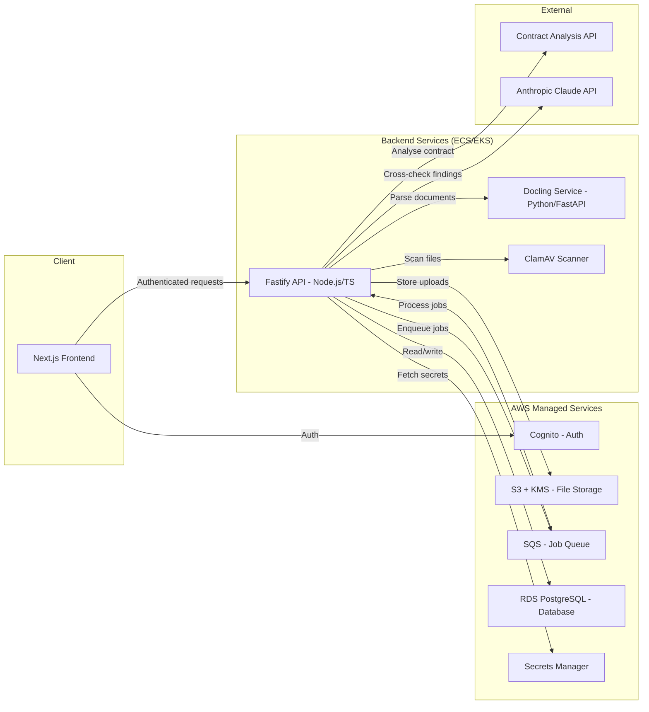
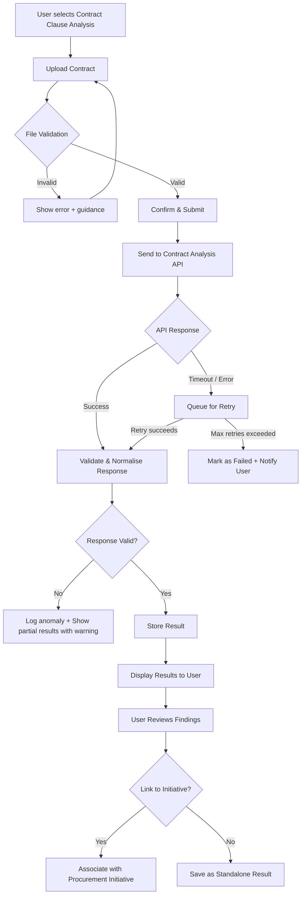
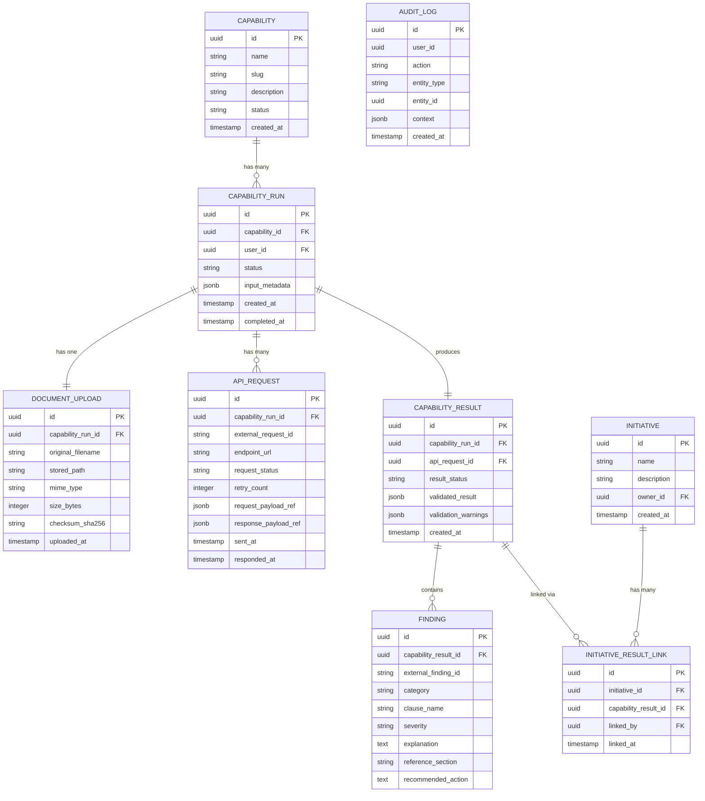
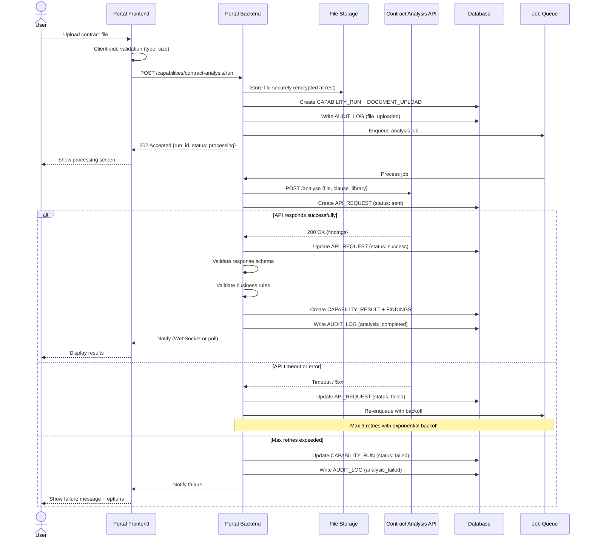

# Contract Clause Analysis — Capability Design (V1)

**Author**: Gareth Daine
**Date**: 18 March 2026
**Context**: Enterprise Procurement Portal — First Capability Build

---

## 1. Approach

This document describes how to build the first working version of the Contract Clause Analysis capability for the procurement portal. The design prioritises three things: getting something reliable into users' hands quickly, building a foundation that future capabilities can reuse, and not over-engineering what doesn't need to exist yet.

The external Contract Analysis API does the heavy lifting — our job is to build the workflow around it that makes it usable, trustworthy, and auditable for enterprise procurement teams.

---

## 2. V1 Tech Stack

### 2.1 Overview

| Layer | Technology | Rationale |
|-------|-----------|-----------|
| **Frontend** | Next.js + React (TypeScript) | SSR for initial load performance, strong enterprise adoption, shared language with backend |
| **Backend / API** | Node.js + Fastify (TypeScript) | Fast async I/O for API orchestration, TypeScript end-to-end, lightweight and performant |
| **Document Parsing** | Docling (Python microservice) | IBM open-source parser with strong layout understanding, table extraction, and multi-format support (PDF, DOCX) |
| **Analysis Accuracy** | Schema validation + confidence scoring + LLM cross-check (Anthropic Claude API) | Three-layer validation: structural checks, confidence scoring on findings, and LLM second opinion on flagged items |
| **Auth** | AWS Cognito | Managed identity for enterprise SSO, JWT-based session management |
| **File Storage** | AWS S3 + KMS | Server-side encryption at rest, signed URLs for secure access, lifecycle policies for retention |
| **Secrets Management** | AWS Secrets Manager | API keys, external service credentials, rotation support |
| **Virus Scanning** | ClamAV (containerised) | Open-source, runs in-pipeline before files reach storage or analysis API |
| **Job Queue** | AWS SQS or BullMQ (Redis) | Async processing with retry semantics, dead-letter queues for failed jobs |
| **Database** | PostgreSQL (AWS RDS) | JSONB support for flexible payloads, strong relational model for audit trail, mature and enterprise-proven |
| **Infrastructure** | AWS (ECS Fargate or EKS) | Container orchestration for the Node.js backend and Docling microservice |

### 2.2 Architecture



### 2.3 Document Parsing — Docling Microservice

Docling runs as a standalone FastAPI service, separate from the main backend. This keeps the Python dependency isolated and allows independent scaling.

**Flow**: Upload lands in S3 → Backend calls Docling service with a signed URL → Docling extracts structured text, tables, and section headings → Returns parsed content → Backend sends parsed content to the Contract Analysis API.

**Why Docling over raw file passthrough?** Pre-parsing gives us control over what the analysis API receives. We can normalise document structure, strip irrelevant content (headers, footers, page numbers), and ensure consistent input quality regardless of the original file format. It also means we're not locked into whatever parsing the external API does internally.

### 2.4 Analysis Accuracy — Three-Layer Validation

The brief states the external API performs the analysis. Our job is to ensure what reaches the user is trustworthy. Three layers handle this:

**Layer 1 — Schema Validation**
Structural check. Does the response match our expected JSON schema? Are required fields present? Are enum values valid? This catches malformed responses and API version drift. Fast, deterministic, zero cost.

**Layer 2 — Confidence Scoring**
Each finding from the API is scored based on completeness and specificity. A finding with a specific section reference, a clear explanation, and a concrete recommended action scores higher than a vague or incomplete finding. Low-confidence findings are flagged for Layer 3.

Scoring factors: presence of `reference_section`, explanation length and specificity, whether `recommended_action` is actionable vs. generic, severity consistency with the finding category.

**Layer 3 — LLM Cross-Check (Anthropic Claude API)**
Findings flagged as low-confidence by Layer 2 are sent to Claude for a second opinion. The LLM receives the original contract text (from Docling) and the flagged finding, and is asked: does this finding appear accurate given the contract content?

This catches false positives and misclassifications from the primary analysis API. In V1, this runs asynchronously — results display immediately with high-confidence findings, and cross-checked findings update once the LLM review completes. Users see a clear "Verified" or "Under Review" badge on each finding.

**Cost control**: Only low-confidence findings hit the LLM. In typical usage, this is expected to be 10-20% of findings, keeping API costs manageable.

---

## 3. Overall Workflow

The capability follows a five-stage pattern that will become the standard template for all future capabilities.



**What this gives us**: a clear, linear happy path with explicit handling at every failure point. Users always know where they are, and the system never silently fails.

---

## 4. User Experience Flow

The user journey is deliberately simple — four screens max.

**Screen 1 — Capability Landing**
Brief description of what the analysis does, what file types are accepted, and what the user will get back. A single "Upload Contract" call-to-action.

**Screen 2 — Upload & Confirm**
Drag-and-drop upload area. Client-side validation runs immediately (file type, size). Once uploaded, show the file name and a "Run Analysis" button. No unnecessary form fields in V1 — the contract is the only input.

**Screen 3 — Processing**
A status screen showing progress. If the API responds quickly (<10s), this may flash past. If it takes longer, show an estimated wait with the option to navigate away and be notified when complete. Critical: never leave users staring at a spinner with no information.

**Screen 4 — Results**
Structured display of the analysis findings, grouped into three categories: missing clauses, unusual clauses, and clauses requiring negotiation. Each finding shows the clause name, severity/risk level, a plain-language explanation, and the relevant contract section. A "Link to Initiative" button lets the user associate results with an existing procurement initiative.

---

## 5. API Integration Design

### 5.1 Request to Contract Analysis API

```json
{
  "request_id": "uuid-v4",
  "file": "<base64-encoded-document or presigned-url>",
  "file_metadata": {
    "filename": "supplier-contract-2026.pdf",
    "mime_type": "application/pdf",
    "size_bytes": 245000,
    "checksum_sha256": "abc123..."
  },
  "clause_library_version": "v2.1",
  "callback_url": "https://portal.example.com/api/webhooks/capability-result"
}
```

### 5.2 Expected API Response Structure

```json
{
  "request_id": "uuid-v4",
  "status": "completed",
  "analysis_version": "v2.1",
  "processed_at": "2026-03-18T14:30:00Z",
  "summary": {
    "total_clauses_checked": 47,
    "missing_count": 3,
    "unusual_count": 2,
    "negotiation_count": 5
  },
  "findings": [
    {
      "finding_id": "f-001",
      "category": "missing",
      "clause_name": "Data Processing Agreement",
      "severity": "high",
      "explanation": "No data processing clause was found. This is typically required for suppliers handling personal data under GDPR.",
      "reference_section": null,
      "recommended_action": "Add a standard DPA clause before execution."
    },
    {
      "finding_id": "f-002",
      "category": "unusual",
      "clause_name": "Limitation of Liability",
      "severity": "medium",
      "explanation": "The liability cap is set at 10x the annual contract value, which exceeds the typical range of 1-2x.",
      "reference_section": "Section 14.2",
      "recommended_action": "Review and negotiate the liability cap to align with organisational risk policy."
    },
    {
      "finding_id": "f-003",
      "category": "negotiation",
      "clause_name": "Termination for Convenience",
      "severity": "low",
      "explanation": "The termination notice period is 90 days. Industry standard is 30-60 days.",
      "reference_section": "Section 22.1",
      "recommended_action": "Consider negotiating a shorter notice period."
    }
  ]
}
```

### 5.3 Response Validation Rules

Before any result is shown to a user, the response must pass validation:

| Check | Rule | On Failure |
|-------|------|------------|
| Schema validation | Response matches expected JSON schema | Reject, log, alert ops |
| Request ID match | Response `request_id` matches our original request | Reject as potential mismatch |
| Finding completeness | Every finding has `category`, `severity`, `explanation` | Strip incomplete findings, warn user |
| Severity values | Must be `high`, `medium`, or `low` | Default to `medium`, log anomaly |
| Category values | Must be `missing`, `unusual`, or `negotiation` | Reject finding, log |
| Clause library version | Matches the version we sent in the request | Warn user results may use an older library |

This validation layer is the contract between the API and our users. It ensures we never display garbage data, even if the external API has a bad day.

---

## 6. Data Model



### Design Decisions

**Why separate `API_REQUEST` from `CAPABILITY_RESULT`?** Traceability. If a run required two retries before succeeding, we have a record of all three attempts. If something looks wrong in a result, we can trace it back to the exact API response that produced it.

**Why `FINDING` as its own table instead of JSONB?** Findings are the primary unit of value for users. Making them first-class entities means we can query across results (e.g., "show me all contracts missing a DPA clause"), build dashboards, and let users annotate individual findings in future versions.

**Why `AUDIT_LOG`?** Enterprise procurement requires auditability. Every significant action — upload, submission, result viewed, result linked — gets logged with context. This is non-negotiable for enterprise, and cheap to implement from the start.

---

## 7. Processing Sequence



---

## 8. Guardrails & Error Handling

### File Upload Security
- **V1 accepted types**: PDF, DOCX only. Strict MIME type checking (not just extension).
- **Max file size**: 25MB (configurable).
- **Virus scanning**: Run uploaded files through ClamAV (or equivalent) before processing.
- **Storage**: Files stored in a private bucket with server-side encryption. Access only via signed, time-limited URLs. Files are never served directly.
- **Checksums**: SHA-256 hash computed on upload, verified before sending to API. Ensures integrity end-to-end.

### API Resilience
- **Timeout**: 60-second timeout per API call. Procurement contracts can be large, so this is generous but bounded.
- **Retries**: Max 3 retries with exponential backoff (5s, 15s, 45s). Each attempt logged.
- **Circuit breaker**: If the external API fails 5 consecutive times across any runs, trip a circuit breaker. New submissions go into a pending queue rather than hitting a known-dead API. Alert the ops team.
- **Idempotency**: Use `request_id` as an idempotency key with the external API to prevent duplicate processing on retries.

### Result Integrity
- **Schema validation**: Every API response validated against a JSON Schema before processing.
- **Partial results**: If some findings fail validation but others pass, show the valid findings with a clear banner: "X of Y findings could not be displayed. Our team has been notified."
- **Immutability**: Once a `CAPABILITY_RESULT` is created, it is never modified. If re-analysis is needed, a new `CAPABILITY_RUN` is created. This protects the audit trail.

### Audit Trail
Every user action and system event writes to `AUDIT_LOG` with: who did it, what they did, which entity was affected, and a context blob with relevant details. In V1, this is a simple append-only table. No deletions, no updates.

---

## 9. Implementation Plan

### Phase 1 — Foundation
Set up the capability framework that all future capabilities will reuse.

- [ ] **Capability data model** — migrations for all tables in Section 6
- [ ] **File upload service** — secure upload, validation, storage, checksum
- [ ] **Capability run lifecycle** — state machine (created → processing → completed/failed)
- [ ] **Audit logging service** — generic, reusable across all capabilities
- [ ] **Job queue setup** — for async API calls with retry logic

### Phase 2 — Contract Analysis Integration
Wire up the specific capability.

- [ ] **API client** — typed client for the Contract Analysis API with timeout, retry, circuit breaker
- [ ] **Response validation** — JSON Schema validation + business rule checks
- [ ] **Result processing** — transform validated response into `CAPABILITY_RESULT` + `FINDING` records
- [ ] **Notification service** — notify frontend when processing completes (WebSocket or polling in V1)

### Phase 3 — Frontend
Build the four screens described in Section 4.

- [ ] **Capability landing page** — description + upload CTA
- [ ] **Upload & confirm screen** — drag-drop, client-side validation, submit
- [ ] **Processing screen** — status polling, estimated wait, navigate-away option
- [ ] **Results screen** — findings grouped by category, severity badges, link-to-initiative action

### Phase 4 — Hardening
Make it enterprise-ready.

- [ ] **Error state UX** — clear messaging for every failure mode
- [ ] **Virus scanning integration** — ClamAV or managed equivalent
- [ ] **End-to-end testing** — happy path, timeout, partial failure, invalid file
- [ ] **Audit log review** — verify all required events are captured
- [ ] **Load testing** — verify behaviour under concurrent uploads
- [ ] **Security review** — file handling, API key management, access controls

---

## 10. What We Deliberately Keep Simple in V1

| Area | V1 Approach | Future Enhancement |
|------|-------------|-------------------|
| **Clause library** | Single default library, version pinned | User-selectable libraries, custom clause sets |
| **Notifications** | Frontend polls for status every 5s | WebSocket push notifications |
| **User roles** | All portal users can run the capability | Role-based access per capability |
| **Re-analysis** | User creates a new run from scratch | "Re-run with updated library" button |
| **Finding annotations** | View-only results | Users can accept/dismiss/comment on findings |
| **Bulk analysis** | One contract per run | Batch upload multiple contracts |
| **Reporting** | Individual results only | Cross-contract dashboards and trend analysis |
| **Initiative linking** | Simple FK association | Rich initiative management with status tracking |

**The principle**: V1 proves the workflow works end-to-end and is trustworthy. V2 makes it powerful.

---

## 11. Extensibility — Building for Future Capabilities

The design intentionally separates the **capability framework** (the reusable parts) from the **Contract Clause Analysis specifics**. Here's what's reusable from day one:

**Generic capability framework (reusable)**:
- `CAPABILITY` + `CAPABILITY_RUN` lifecycle and state machine
- File upload service with validation, scanning, and secure storage
- Async job processing with retry and circuit breaker patterns
- Response validation pipeline (schema check → business rules → store)
- Audit logging
- Result-to-initiative linking
- Processing status UI pattern

**Capability-specific (unique per capability)**:
- Which API to call and how
- Response schema and validation rules
- How to transform findings for display
- What the results screen looks like

Adding a second capability (e.g., "Supplier Risk Assessment") would mean defining a new API client, a new response schema, a new results view, and plugging into the existing framework. The upload, processing, auditing, and linking infrastructure is already there.

---

## 12. Key Technical Risks & Mitigations

| Risk | Impact | Likelihood | Mitigation |
|------|--------|------------|------------|
| **External API unreliable** | Users can't complete analysis | Medium | Retry with backoff + circuit breaker. Clear user messaging. Queue submissions during outages. |
| **Large files cause timeouts** | Upload or API call fails | Medium | Chunked upload for large files. Generous but bounded API timeout. Async processing means the user isn't blocked. |
| **API response schema changes** | Validation rejects valid results | Low | Pin API version. Schema validation logs warnings before hard-rejecting. Monitor for drift. |
| **File security vulnerability** | Malicious file upload | Low | Never execute uploaded files. Virus scan. Strict type checking. Store in isolated, encrypted bucket. |
| **Audit log becomes bottleneck** | Slow writes under load | Low | Async audit log writes via queue. Audit log is append-only — no contention from reads. |
| **Vendor lock-in to analysis API** | Switching cost if API provider changes | Medium | Adapter pattern around API client. Our data model stores normalised results, not raw API responses. |

---

## 13. Summary

This design gives us a working Contract Clause Analysis capability that is reliable enough for enterprise use, auditable from end to end, and resilient to the external API having a bad day. It's scoped tightly — four screens, one input (a contract), one output (structured findings).

More importantly, roughly 60% of what we build is reusable. The second capability will take significantly less effort because the framework is already there.

The deliberate V1 simplifications (single clause library, polling instead of push, no bulk upload) aren't shortcuts — they're scope decisions. Each one has a clear upgrade path for when user demand justifies the complexity.
