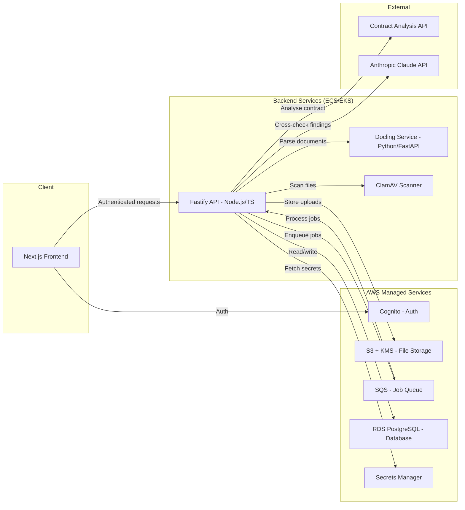
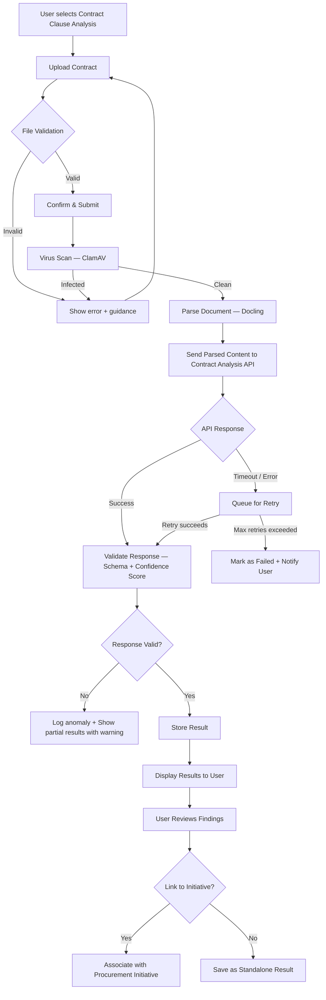
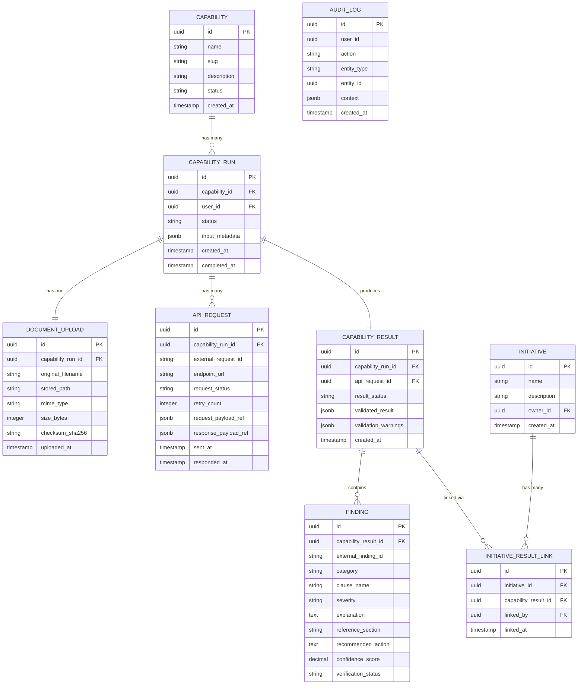
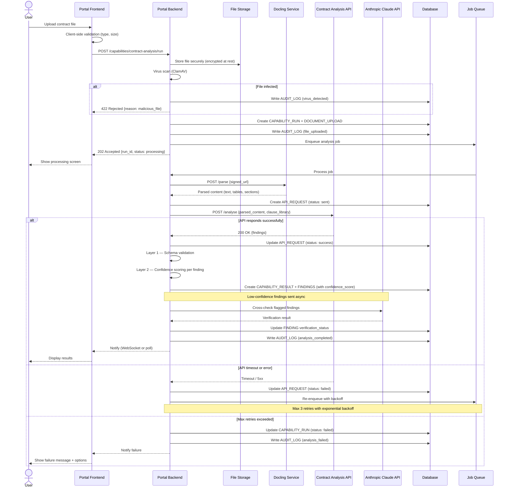

# Contract Clause Analysis — Capability Design (V1)

**Author**: Gareth Daine
**Date**: 18 March 2026
**Context**: Enterprise Procurement Portal — First Capability Build

---

## 1. Approach

This document describes how to build the first working version of the Contract Clause Analysis capability for the procurement portal. The design prioritises three things: getting something reliable into users' hands quickly, building a foundation that future capabilities can reuse, and not over-engineering what doesn't need to exist yet.

The external Contract Analysis API does the heavy lifting — our job is to build the workflow around it that makes it usable, trustworthy, and auditable for enterprise procurement teams.

---

## 2. V1 Tech Stack

### 2.1 Overview

| Layer | Technology | Rationale |
|-------|-----------|-----------|
| **Frontend** | Next.js + React (TypeScript) | SSR for initial load performance, strong enterprise adoption, shared language with backend |
| **Backend / API** | Node.js + Fastify (TypeScript) | Fast async I/O for API orchestration, TypeScript end-to-end, lightweight and performant |
| **Document Parsing** | Docling (Python microservice) | IBM open-source parser with strong layout understanding, table extraction, and multi-format support (PDF, DOCX) |
| **Analysis Accuracy** | Schema validation + confidence scoring + LLM cross-check (Anthropic Claude API) | Three-layer validation: structural checks, confidence scoring on findings, and LLM second opinion on flagged items |
| **Auth** | AWS Cognito | Managed identity for enterprise SSO, JWT-based session management |
| **File Storage** | AWS S3 + KMS | Server-side encryption at rest, signed URLs for secure access, lifecycle policies for retention |
| **Secrets Management** | AWS Secrets Manager | API keys, external service credentials, rotation support |
| **Virus Scanning** | ClamAV (containerised) | Open-source, runs in-pipeline before files reach storage or analysis API |
| **Job Queue** | AWS SQS | Managed async processing with retry semantics, dead-letter queues for failed jobs, no additional infrastructure to operate |
| **Database** | PostgreSQL (AWS RDS) | JSONB support for flexible payloads, strong relational model for audit trail, mature and enterprise-proven |
| **Infrastructure** | AWS (ECS Fargate or EKS) | Container orchestration for the Node.js backend and Docling microservice |

### 2.2 Architecture



### 2.3 Document Parsing — Docling Microservice

Docling runs as a standalone FastAPI service, separate from the main backend. This keeps the Python dependency isolated and allows independent scaling.

**Flow**: Upload lands in S3 → Backend calls Docling service with a signed URL → Docling extracts structured text, tables, and section headings → Returns parsed content → Backend sends parsed content to the Contract Analysis API.

**Why Docling over raw file passthrough?** Pre-parsing gives us control over what the analysis API receives. We can normalise document structure, strip irrelevant content (headers, footers, page numbers), and ensure consistent input quality regardless of the original file format. It also means we're not locked into whatever parsing the external API does internally.

### 2.4 Analysis Accuracy — Three-Layer Validation

The brief states the external API performs the analysis. Our job is to ensure what reaches the user is trustworthy. Three layers handle this:

**Layer 1 — Schema Validation**
Structural check. Does the response match our expected JSON schema? Are required fields present? Are enum values valid? This catches malformed responses and API version drift. Fast, deterministic, zero cost.

**Layer 2 — Confidence Scoring**
Each finding from the API is scored based on completeness and specificity. A finding with a specific section reference, a clear explanation, and a concrete recommended action scores higher than a vague or incomplete finding. Low-confidence findings are flagged for Layer 3.

Scoring factors: presence of `reference_section`, explanation length and specificity, whether `recommended_action` is actionable vs. generic, severity consistency with the finding category.

**Layer 3 — LLM Cross-Check (Anthropic Claude API)**
Findings flagged as low-confidence by Layer 2 are sent to Claude for a second opinion. The LLM receives the original contract text (from Docling) and the flagged finding, and is asked: does this finding appear accurate given the contract content?

This catches false positives and misclassifications from the primary analysis API. In V1, this runs asynchronously — results display immediately with high-confidence findings, and cross-checked findings update once the LLM review completes. Users see a clear "Verified" or "Under Review" badge on each finding.

**Cost control**: Only low-confidence findings hit the LLM. In typical usage, this is expected to be 10-20% of findings, keeping API costs manageable.

---

## 3. Overall Workflow

The capability follows a five-stage pattern that will become the standard template for all future capabilities.



**What this gives us**: a clear, linear happy path with explicit handling at every failure point. Users always know where they are, and the system never silently fails.

---

## 4. User Experience Flow

The user journey is deliberately simple — four screens max.

**Screen 1 — Capability Landing**
Brief description of what the analysis does, what file types are accepted, and what the user will get back. A single "Upload Contract" call-to-action.

**Screen 2 — Upload & Confirm**
Drag-and-drop upload area. Client-side validation runs immediately (file type, size). Once uploaded, show the file name and a "Run Analysis" button. No unnecessary form fields in V1 — the contract is the only input.

**Screen 3 — Processing**
A status screen showing progress. If the API responds quickly (<10s), this may flash past. If it takes longer, show an estimated wait with the option to navigate away and be notified when complete. Critical: never leave users staring at a spinner with no information.

**Screen 4 — Results**
Structured display of the analysis findings, grouped into three categories: missing clauses, unusual clauses, and clauses requiring negotiation. Each finding shows the clause name, severity/risk level, a plain-language explanation, the relevant contract section, and a verification badge — "Verified" for high-confidence findings that passed all validation layers, or "Under Review" for findings still awaiting the LLM cross-check (see Section 2.4). A "Link to Initiative" button lets the user associate results with an existing procurement initiative.

---

## 5. API Integration Design

### 5.1 Request to Contract Analysis API

```json
{
  "request_id": "uuid-v4",
  "parsed_content": "<structured text extracted by Docling>",
  "file_metadata": {
    "filename": "supplier-contract-2026.pdf",
    "mime_type": "application/pdf",
    "size_bytes": 245000,
    "checksum_sha256": "abc123..."
  },
  "clause_library_version": "v2.1",
  "callback_url": "https://portal.example.com/api/webhooks/capability-result"
}
```

### 5.2 Expected API Response Structure

```json
{
  "request_id": "uuid-v4",
  "status": "completed",
  "analysis_version": "v2.1",
  "processed_at": "2026-03-18T14:30:00Z",
  "summary": {
    "total_clauses_checked": 47,
    "missing_count": 3,
    "unusual_count": 2,
    "negotiation_count": 5
  },
  "findings": [
    {
      "finding_id": "f-001",
      "category": "missing",
      "clause_name": "Data Processing Agreement",
      "severity": "high",
      "explanation": "No data processing clause was found. This is typically required for suppliers handling personal data under GDPR.",
      "reference_section": null,
      "recommended_action": "Add a standard DPA clause before execution."
    },
    {
      "finding_id": "f-002",
      "category": "unusual",
      "clause_name": "Limitation of Liability",
      "severity": "medium",
      "explanation": "The liability cap is set at 10x the annual contract value, which exceeds the typical range of 1-2x.",
      "reference_section": "Section 14.2",
      "recommended_action": "Review and negotiate the liability cap to align with organisational risk policy."
    },
    {
      "finding_id": "f-003",
      "category": "negotiation",
      "clause_name": "Termination for Convenience",
      "severity": "low",
      "explanation": "The termination notice period is 90 days. Industry standard is 30-60 days.",
      "reference_section": "Section 22.1",
      "recommended_action": "Consider negotiating a shorter notice period."
    }
  ]
}
```

### 5.3 Response Validation Rules

Before any result is shown to a user, the response must pass validation:

| Check | Rule | On Failure |
|-------|------|------------|
| Schema validation | Response matches expected JSON schema | Reject, log, alert ops |
| Request ID match | Response `request_id` matches our original request | Reject as potential mismatch |
| Finding completeness | Every finding has `category`, `severity`, `explanation` | Strip incomplete findings, warn user |
| Severity values | Must be `high`, `medium`, or `low` | Default to `medium`, log anomaly |
| Category values | Must be `missing`, `unusual`, or `negotiation` | Reject finding, log |
| Clause library version | Matches the version we sent in the request | Warn user results may use an older library |

This validation layer is the contract between the API and our users. It ensures we never display garbage data, even if the external API has a bad day.

---

## 6. Data Model



### Design Decisions

**Why separate `API_REQUEST` from `CAPABILITY_RESULT`?** Traceability. If a run required two retries before succeeding, we have a record of all three attempts. If something looks wrong in a result, we can trace it back to the exact API response that produced it.

**Why `FINDING` as its own table instead of JSONB?** Findings are the primary unit of value for users. Making them first-class entities means we can query across results (e.g., "show me all contracts missing a DPA clause"), build dashboards, and let users annotate individual findings in future versions.

**Why `confidence_score` and `verification_status` on `FINDING`?** These columns support the three-layer validation described in Section 2.4. Each finding gets a confidence score from Layer 2, and a verification status (`verified`, `under_review`, `flagged`) updated by the Layer 3 LLM cross-check. This lets the frontend show "Verified" or "Under Review" badges per finding.

**Why `AUDIT_LOG`?** Enterprise procurement requires auditability. Every significant action — upload, submission, result viewed, result linked — gets logged with context. This is non-negotiable for enterprise, and cheap to implement from the start.

---

## 7. Processing Sequence



---

## 8. Guardrails & Error Handling

### File Upload Security
- **V1 accepted types**: PDF, DOCX only. Strict MIME type checking (not just extension).
- **Max file size**: 25MB (configurable).
- **Virus scanning**: Run uploaded files through ClamAV (or equivalent) before processing.
- **Storage**: Files stored in a private bucket with server-side encryption. Access only via signed, time-limited URLs. Files are never served directly.
- **Checksums**: SHA-256 hash computed on upload, verified before sending to API. Ensures integrity end-to-end.

### API Resilience
- **Timeout**: 60-second timeout per API call. Procurement contracts can be large, so this is generous but bounded.
- **Retries**: Max 3 retries with exponential backoff (5s, 15s, 45s). Each attempt logged.
- **Circuit breaker**: If the external API fails 5 consecutive times across any runs, trip a circuit breaker. New submissions go into a pending queue rather than hitting a known-dead API. Alert the ops team.
- **Idempotency**: Use `request_id` as an idempotency key with the external API to prevent duplicate processing on retries.

### Result Integrity
- **Schema validation**: Every API response validated against a JSON Schema before processing.
- **Partial results**: If some findings fail validation but others pass, show the valid findings with a clear banner: "X of Y findings could not be displayed. Our team has been notified."
- **Immutability**: Once a `CAPABILITY_RESULT` is created, it is never modified. If re-analysis is needed, a new `CAPABILITY_RUN` is created. This protects the audit trail.

### Audit Trail
Every user action and system event writes to `AUDIT_LOG` with: who did it, what they did, which entity was affected, and a context blob with relevant details. In V1, this is a simple append-only table. No deletions, no updates.

---

## 9. Observability & Monitoring

Enterprise systems need to be observable from day one. V1 includes structured logging, key metrics, and alerting on the critical path.

### Structured Logging
All services emit JSON-structured logs with correlation IDs (`capability_run_id`) that trace a request end-to-end — from upload through Docling parsing, API call, validation, and result storage. This makes debugging production issues straightforward: filter by `run_id` and see the full story.

### Key Metrics (CloudWatch / Prometheus)
| Metric | Purpose | Alert Threshold |
|--------|---------|----------------|
| `capability_run.duration_ms` | End-to-end processing time | P95 > 120s |
| `external_api.latency_ms` | Contract Analysis API response time | P95 > 45s |
| `external_api.error_rate` | API failure rate (triggers circuit breaker awareness) | > 10% over 5 min |
| `docling.parse_duration_ms` | Document parsing time | P95 > 30s |
| `finding.low_confidence_rate` | % findings sent to LLM cross-check | > 40% (may indicate API quality issue) |
| `upload.virus_detected_count` | Malicious file attempts | Any occurrence |

### Health Checks
Each service exposes a `/health` endpoint returning its status and dependency connectivity. The load balancer routes traffic only to healthy instances. A degraded state (e.g., external API unreachable) is surfaced in the portal admin panel.

### Data Retention
- **Contract files in S3**: 90-day retention by default, configurable per client. After retention period, files are moved to Glacier or deleted per policy.
- **Capability results and findings**: Retained indefinitely in the database (audit requirement). Results linked to initiatives inherit the initiative's retention policy.
- **Audit logs**: Retained for a minimum of 7 years (standard enterprise compliance). Append-only, never deleted.

### Data Residency & GDPR
All infrastructure runs in a single AWS region, selected per deployment to meet client data residency requirements. Supplier contracts and analysis results never leave the chosen region. For GDPR right-to-deletion requests, contract files in S3 can be purged, but audit log entries are retained with personally identifiable fields redacted rather than deleted — balancing the right to erasure against the enterprise audit requirement.

---

## 10. Implementation Plan

### Phase 1 — Foundation
Set up the capability framework that all future capabilities will reuse.

- [ ] **Capability data model** — migrations for all tables in Section 6, including `confidence_score` and `verification_status` on FINDING
- [ ] **File upload service** — secure upload, validation, storage, checksum
- [ ] **Capability run lifecycle** — state machine (created → processing → completed/failed)
- [ ] **Audit logging service** — generic, reusable across all capabilities
- [ ] **Job queue setup** — for async API calls with retry logic

### Phase 2 — Contract Analysis Integration
Wire up the specific capability.

- [ ] **API client** — typed client for the Contract Analysis API with timeout, retry, circuit breaker
- [ ] **Response validation** — JSON Schema validation + business rule checks
- [ ] **Result processing** — transform validated response into `CAPABILITY_RESULT` + `FINDING` records
- [ ] **LLM cross-check service** — async Claude API calls for low-confidence findings, update verification status
- [ ] **Notification service** — notify frontend when processing completes (WebSocket or polling in V1)

### Phase 3 — Frontend
Build the four screens described in Section 4.

- [ ] **Capability landing page** — description + upload CTA
- [ ] **Upload & confirm screen** — drag-drop, client-side validation, submit
- [ ] **Processing screen** — status polling, estimated wait, navigate-away option
- [ ] **Results screen** — findings grouped by category, severity badges, link-to-initiative action

### Phase 4 — Hardening
Make it enterprise-ready.

- [ ] **Error state UX** — clear messaging for every failure mode
- [ ] **Virus scanning integration** — ClamAV or managed equivalent
- [ ] **End-to-end testing** — happy path, timeout, partial failure, invalid file
- [ ] **Audit log review** — verify all required events are captured
- [ ] **Load testing** — verify behaviour under concurrent uploads
- [ ] **Observability setup** — structured logging with correlation IDs, key metrics, health checks, alerting
- [ ] **Security review** — file handling, API key management, access controls

---

## 11. Testing, CI/CD & Deployment Strategy

### 11.1 Testing Strategy

**Unit tests** — Jest for both the Next.js frontend and Fastify backend (single test runner across the TypeScript codebase). pytest for the Docling microservice. Focus unit tests on business logic: response validation rules, confidence scoring algorithm, finding transformation, and capability run state machine transitions. Target 80% coverage on core services; don't chase coverage on glue code or route definitions.

**Integration tests** — Test the boundaries where things actually break:
- **API client**: Mock the external Contract Analysis API at the HTTP layer (e.g., `nock` or `msw`) to verify timeout handling, retry logic, circuit breaker behaviour, and response validation against known good/bad payloads.
- **Database**: Run integration tests against a real PostgreSQL instance (Docker in CI). Test migrations, audit log writes, and the full capability run lifecycle from `created` through to `completed`/`failed`.
- **Docling contract tests**: Verify the interface between the backend and Docling service stays consistent — the backend sends a signed URL, Docling returns structured content in the expected shape. These catch drift if either side changes independently.

**End-to-end tests** — Playwright for browser-based flows. Cover the non-negotiable paths:
1. Happy path: upload → processing → results displayed with correct categories and badges
2. Invalid file: upload rejected with clear error message
3. API timeout: processing screen shows appropriate wait state, retry completes, results appear
4. Partial failure: some findings stripped, user sees warning banner
5. Virus detected: upload rejected before processing begins

**Testing the three-layer validation pipeline:**
- Layer 1 (schema validation): unit tests with deliberately malformed payloads — missing fields, wrong types, invalid enums. Deterministic and fast.
- Layer 2 (confidence scoring): unit tests with curated findings at known confidence levels. Verify scoring factors are weighted correctly and that the right findings get flagged for Layer 3.
- Layer 3 (LLM cross-check): integration test with a mocked Claude API response. Verify that flagged findings are sent, verification status updates correctly, and the async flow doesn't block result display.

**What we skip in V1**: performance/load testing is manual (Section 10, Phase 4). No visual regression testing. No accessibility audit automation — these move to V2 once the core workflow is stable.

### 11.2 CI/CD Pipeline

**Pipeline stages** (GitHub Actions):

```
lint → unit test → integration test → build → deploy
```

1. **Lint** — ESLint + Prettier (TypeScript), Ruff (Python/Docling). Fast, fails first.
2. **Unit test** — Jest + pytest in parallel. Coverage report generated but not gated in V1 (tracked, not enforced).
3. **Integration test** — Spins up PostgreSQL via Docker service container. Runs database and API client integration tests.
4. **Build** — Builds Docker images for the Fastify backend and Docling microservice. Tags with git SHA + `latest`.
5. **Deploy** — Pushes images to Amazon ECR. Triggers ECS service update (staging on merge to `main`, production on manual approval).

**Branch strategy** — Trunk-based for V1. Feature branches merge to `main` via pull request with required CI pass. No long-lived branches. Release tagging for production deploys.

**Database migrations** — Run as a pre-deploy step in the CI pipeline using a migration tool (e.g., `node-pg-migrate` or Prisma Migrate). Migrations execute against the target environment's database before the new containers roll out. Destructive migrations (column drops, table deletes) require manual approval in the pipeline.

**Container registry** — Amazon ECR, one repository per service (`portal-backend`, `docling-service`). Images tagged with git SHA for traceability and `latest` for convenience. Old images cleaned up by ECR lifecycle policy (retain last 20).

### 11.3 Deployment Strategy

**Infrastructure-as-code** — AWS CDK (TypeScript), matching the backend language. Defines ECS services, RDS instance, SQS queues, S3 buckets, Cognito user pool, and networking. All infrastructure changes go through the same PR and CI process as application code.

**Service deployment** — The Fastify backend and Docling microservice deploy independently as separate ECS services. Each has its own task definition, scaling policy, and health check. Independent deployments mean a Docling update doesn't require a backend redeploy, and vice versa. The Next.js frontend deploys as a static export to S3 + CloudFront — separate from the backend release cycle, and consistent with the AWS-native infrastructure.

**Zero-downtime deploys** — ECS rolling update strategy. New task instances register with the load balancer, pass health checks, then old instances drain and stop. Minimum healthy percentage set to 100% so capacity never drops during deploys.

**Environment configuration** — Environment variables injected via ECS task definitions. Secrets (API keys, database credentials) pulled from AWS Secrets Manager at container start — never baked into images. Each environment (dev, staging, production) has its own Secrets Manager namespace.

**Rollback** — ECS supports instant rollback to the previous task definition revision. If a deploy fails health checks, ECS automatically rolls back. For database migrations, backward-compatible migrations are the norm in V1 — additive only (new columns, new tables), never destructive, so rollback doesn't require a migration reversal.

### 11.4 V1 Simplifications

| Area | V1 Approach | Future Enhancement |
|------|-------------|-------------------|
| **Load testing** | Manual via Phase 4 hardening | Automated load tests in CI (k6 or Artillery) |
| **Visual regression** | Manual visual QA | Percy or Chromatic snapshot testing |
| **Accessibility** | Manual audit | axe-core in CI, Lighthouse accessibility gate |
| **Canary deploys** | Rolling update only | Canary + automated rollback on error spike |
| **Multi-region** | Single region | Active-passive failover or multi-region active |
| **Pipeline environments** | Dev → staging → production | Add preview environments per PR |

---

## 12. What We Deliberately Keep Simple in V1

| Area | V1 Approach | Future Enhancement |
|------|-------------|-------------------|
| **Clause library** | Single default library, version pinned | User-selectable libraries, custom clause sets |
| **Notifications** | Frontend polls for status every 5s | WebSocket push notifications |
| **User roles** | All portal users can run the capability | Role-based access per capability |
| **Re-analysis** | User creates a new run from scratch | "Re-run with updated library" button |
| **Finding annotations** | View-only results | Users can accept/dismiss/comment on findings |
| **Bulk analysis** | One contract per run | Batch upload multiple contracts |
| **Reporting** | Individual results only | Cross-contract dashboards and trend analysis |
| **Initiative linking** | Simple FK association | Rich initiative management with status tracking |

**The principle**: V1 proves the workflow works end-to-end and is trustworthy. V2 makes it powerful.

---

## 13. Extensibility — Building for Future Capabilities

The design intentionally separates the **capability framework** (the reusable parts) from the **Contract Clause Analysis specifics**. Here's what's reusable from day one:

**Generic capability framework (reusable)**:
- `CAPABILITY` + `CAPABILITY_RUN` lifecycle and state machine
- File upload service with validation, scanning, and secure storage
- Async job processing with retry and circuit breaker patterns
- Response validation pipeline (schema check → business rules → store)
- Audit logging
- Result-to-initiative linking
- Processing status UI pattern

**Capability-specific (unique per capability)**:
- Which API to call and how
- Response schema and validation rules
- How to transform findings for display
- What the results screen looks like

**Capability registration**: New capabilities are database-seeded — a row in the `CAPABILITY` table with a name, slug, and status. The backend routes to the correct API client and validation rules based on the slug. No code deployment is needed to register a capability; the capability-specific logic (API client, schema, results view) is deployed as a module, and the capability becomes available once its database record is set to `active`.

Adding a second capability (e.g., "Supplier Risk Assessment") would mean defining a new API client, a new response schema, a new results view, and plugging into the existing framework. The upload, processing, auditing, and linking infrastructure is already there.

---

## 14. Key Technical Risks & Mitigations

| Risk | Impact | Likelihood | Mitigation |
|------|--------|------------|------------|
| **External API unreliable** | Users can't complete analysis | Medium | Retry with backoff + circuit breaker. Clear user messaging. Queue submissions during outages. |
| **Large files cause timeouts** | Upload or API call fails | Medium | Chunked upload for large files. Generous but bounded API timeout. Async processing means the user isn't blocked. |
| **API response schema changes** | Validation rejects valid results | Low | Pin API version. Schema validation logs warnings before hard-rejecting. Monitor for drift. |
| **File security vulnerability** | Malicious file upload | Low | Never execute uploaded files. Virus scan. Strict type checking. Store in isolated, encrypted bucket. |
| **Audit log becomes bottleneck** | Slow writes under load | Low | Async audit log writes via queue. Audit log is append-only — no contention from reads. |
| **Vendor lock-in to analysis API** | Switching cost if API provider changes | Medium | Adapter pattern around API client. Our data model stores normalised results, not raw API responses. |

---

## 15. Summary

This design addresses the four criteria from the brief:

**Practical to deliver** — The implementation plan breaks the work into four focused phases. Phase 1 builds the reusable framework, Phase 2 wires up the specific capability, Phase 3 builds the UI, and Phase 4 hardens for production. Each phase produces a working increment.

**Reliable for enterprise use** — Three-layer result validation (schema, confidence, LLM cross-check) ensures users never see garbage data. Async processing with retries and circuit breakers handles API instability. Structured observability with alerting means issues are caught before users notice them.

**Extensible for future capabilities** — Roughly 60% of what we build is reusable: the capability lifecycle, file upload pipeline, job processing, audit logging, and result-to-initiative linking. Adding a second capability means defining a new API client, response schema, and results view — plugging into infrastructure that already exists.

**Simple enough not to over-engineer V1** — Section 12 documents eight deliberate scope cuts, each with a clear future upgrade path. Polling instead of WebSockets, single clause library, no bulk upload — these aren't shortcuts, they're scope decisions that keep V1 focused on proving the workflow works end-to-end.

The result is a tightly scoped capability — four screens, one input (a contract), one output (structured findings) — built on a foundation designed to carry the next ten capabilities.
